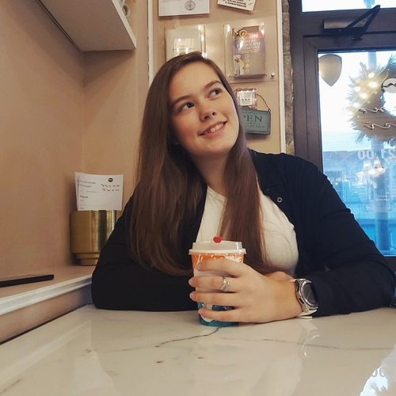
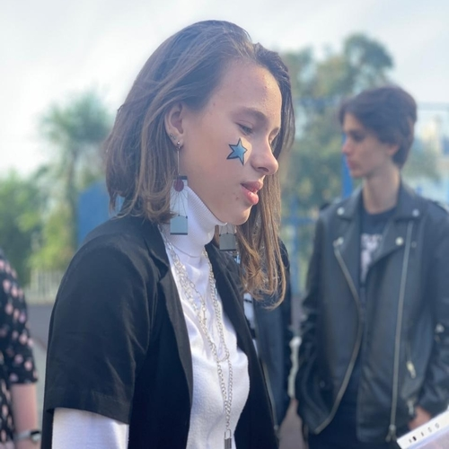
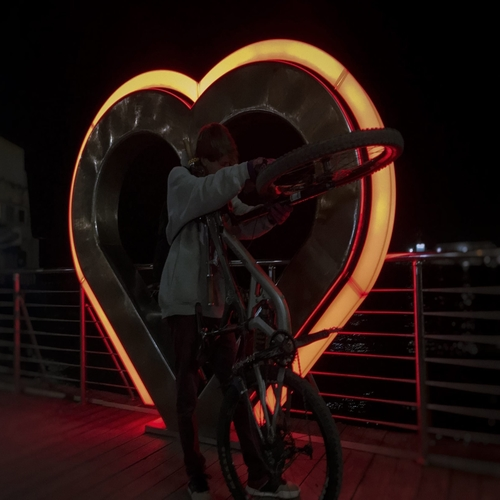
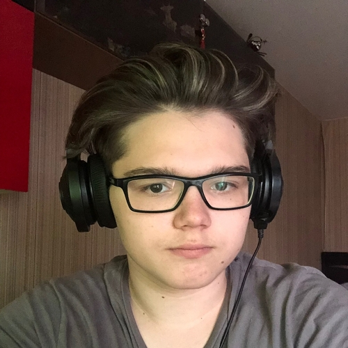

## Добро пожаловать на страницу нашей команды!

Мы - команда "Кукуруза", четверо молодых разрабочиков с большими амбициями и желанием работать и обучаться новому! Хоть мы только недавно начали участвовать в конкурсах, мы стремимся к победе и получению новых знаний и опыта!

# Участники

## Анастасия Киселева

 

##### Анастасия - выпускник Яндекс.Лицея, начинающий разрабочик с небольшим опытом в веб-разработке и гейм-деве. Основной язык программирования - Python, в будущем планирует развиваться в направлении искуственного интеллекта. 

_- Сколько себя помню, мне всегда было интересно, как устроен компьютер. Как работают программы, игры и прочее. Чуть позже я заинтересовалась темой ИИ - удивительно, на что способны технологии сегодня. Теперь, умея программировать на Python, я планирую развиваться в этом направлении и в будущем создать что-то полезное и инновационное._

## Черемисова Мария

 

##### Мария - выпускник Яндекс.Лицея, начинающий разработчик с небольшим опытом в веб-разработке и работой с OpenCV. Основной язык программировния - Python. В будущем планирует развиваться в направлении микроэлектроники.

_- Мне интересно работать с железом и собирать электронику. Мой особенно запоминающийся опыт - запуск собственной ракеты в небо. В будущем я хочу разрабатывать микропроцессоры_

## Ганжа Василий

 

##### Василий - выпускник Яндекс.Лицея, начинающий разработчик с небольшим опытом в веб-разработке и разработке десктопных приложений. Основной язык программирования - Python. В будущем планирует развиваться в веб-направлении.

 _- В детстве никогда не интересовался компьютерами или чем-то подобным, но как только появилась возможность к этому прикоснуться - это была любовь с первого взгляда. Я буду очень счастлив, если в будущем смогу внести вклад в какой-нибудь инновационный проект._

## Марущак Егор

 

##### Егор - начинающий дизайнер с опытом работы в Photoshop, After Effects, Premiere. В будущем Егор планирует создаваться дизайны и монтажи для медийных личностей.

_- Пларирую развиваться в киберспорте и параллельно увлекаться дизайном. Нравиться создавать эффекты и пробовать что-то новое. В будущем хотел бы срабоаться с какими-нибудь блогерами или медиа-гигантами, чтобы помочь им создавать качественные продукты, которые радуют глаз._

